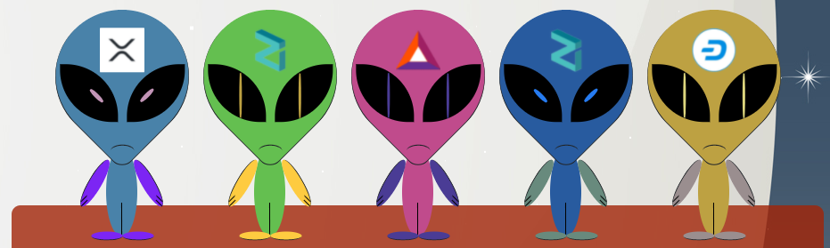
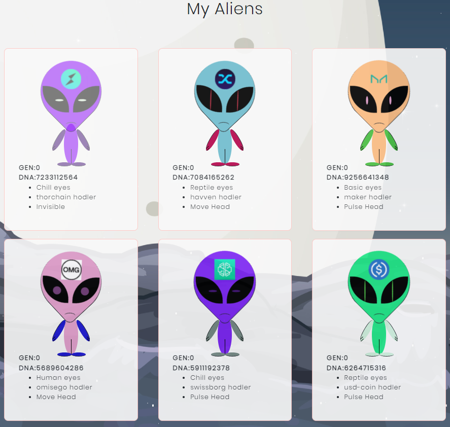

[](https://app.netlify.com)

Website: [https://cryptoaliens.netlify.app](cryptoaliens.netlify.app)

# Cryptoaliens
Cryptoaliens is a ERC721 token, where you can buy, sell and clone your own aliens.

Part of Ivan on Tech [Ivan on Tech Academy](https://academy.ivanontech.com/) bootcamp.
## Contracts Addresses
- AlienToken (CAT): 0x7DE6d04EaEEF8989171d3686573938B47D0B1c84
- AlienFactory (NFT): 0xAF3677129Dceb13DB5Cb6115C9fD69beEfF4cA48
- AlienMarketPlace: 0xC7Bdf1b7dcb806b9aFD5b83C8BC2b0c4aDf2BcB7

## Table of Contents

- [Ethereum](#ethereum)
  - [Smart contract structure](#smart-contract-structure)
  - [ERC721](#erc721)
  - [ERC 165](#erc-165)
  - [Gen0](#gen0)
  - [DNA](#dna)
  - [Randomness](#randomness)
  - [Instalation](#instalation)
  - [Deploy locally](#deploy-locally)
  - [Deploy to test network](#deploy-to-test-network)
- [Client](#client)
  - [Instalation](#instalation-1)
    - [Local development](#local-development)
- [Images](#images)

## Ethereum

Contracts are written in Solidity

- Bootstrapped using [Hardhat](https://hardhat.org/getting-started/#installation)
- [ERC721](http://erc721.org/) compatible

### Smart contract structure

- AlienFactory forms the basic of all aliens interactions. It is split into two(2) contracts, inheriting from eachother to make life more easy.
  - **AlienFactory** is build in the following way
    - **AlienFactory**: All logic to clone aliens and make new gen0
    - **AlienCore**: All logic to make it ERC721 (Openzeppelin)
  - **MarketPlace** is not inheriting from AlienFactory and is a standalone contract. It requires the interface of AlienCore to interact with.

### ERC721

The following standard allows for the implementation of a standard API for NFTs within smart contracts. This standard provides basic functionality to track and transfer NFTs.

A standard interface allows wallet/broker/auction applications to work with any NFT on Ethereum. We provide for simple ERC-721 smart contracts as well as contracts that track an arbitrarily large number of NFTs. Additional applications are discussed below.

- [EIP](https://eips.ethereum.org/EIPS/eip-721)
- [Help](https://docs.openzeppelin.com/contracts/2.x/api/token/erc721)

### ERC 165

ERC165’s solution is to define a standard for contracts to publish what interfaces they support, so that other contracts can follow the same standard to detect whether it supports certain interfaces, and only call the interface’s function if the interface is supported.

- [EIP](https://github.com/ethereum/EIPs/blob/master/EIPS/eip-165.md)
- [Help](https://medium.com/coinmonks/ethereum-standard-erc165-explained-63b54ca0d273)

### Gen0

There is a limited amount of gen0 aliens available, defined by `CREATION_LIMIT_GEN0`. Only the owner can mint new aliens (using `createAlienGen0`)

### DNA

Every alien has unique DNA, comprised of a 10 digits. When cloning 2 aliens, the child will have a mixture between the dna of its mom and its dad. It also has a chance to mutate a gene randomly

### Randomness

Randomness is simulated through using the timestamp of the mined block.

### Instalation

- Have node installed (v10 or later)
- Have yarn installed `npm install -g yarn` (or npm)
- Have hardhat installed `npm install --save-dev hardhat`
- Install dependencies
  ```bash
  yarn install
  // OR
  npm install
  ```

### Deploy locally

- Start up local blockchain (hardhat node)
- Deploy the contracts on your locak blockchain 
    ```bash
    npx hardhat run scripts/alien_deploy.js --network localhost
    ```

### Deploy to test network

- Make a file to store the mnemonic secret in `touch .secret` and add your secret.
- Update the `INFURA_PUBLIC_KEY` in hardhat.config
- Run `npx hardhat run scripts/alien_deploy.js --network ropsten`

NOTE: make sure to have Ether in your first account

## Client

Client is made with Html, css, jquery, javascript, bootstrap, web3.

### Instalation

- Have [python](https://www.python.org/downloads/) installed
- Have a way to run a blockchain locally (via hardhat node)
- Have MetaMask installed

#### Local development

1. `cd client`
2. Make sure that a local blockhain is running (via hardhat node).
3. Start python webserver `python -m http.server`
4. Have all node_modules installed
5. Have local blockchain network added in MetaMask
6. Have local blockchain accounts added in MetaMask
7. Start local development

NOTE: after deploying the contracts with `alien_deploy.js`, it will return the addresses of each contract, make sure they match with `alienFactory_adderss` and `alienMarketplace_address` in `index.js`

## Images



## Useful Links
- [Hardhat](https://hardhat.org/getting-started/#installation)
- [hardhat-truffle5](https://hardhat.org/plugins/nomiclabs-hardhat-truffle5.html)
- [hardhat-web3](https://hardhat.org/plugins/nomiclabs-hardhat-web3.html)
- [Openzeppelin](https://docs.openzeppelin.com/openzeppelin)
- [Openzeppelin TestHelpers](https://docs.openzeppelin.com/test-helpers/0.5/)
- [Python](https://www.python.org/downloads/)